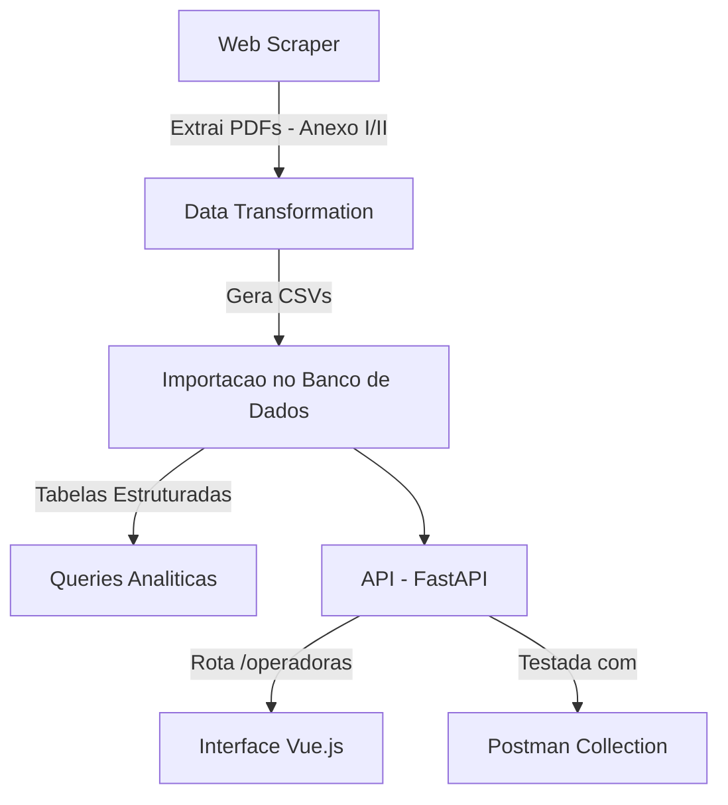

# CareStream

CareStream é um projeto integrado que simula um fluxo real de trabalho na área da saúde. Ele engloba desde a extração e transformação de dados até a disponibilização de uma API e uma interface web interativa para consulta dos registros. O projeto foi desenvolvido seguindo boas práticas de programação, com foco em modularização, escalabilidade e manutenção.


## Arquitetura do Projeto



## Componentes do Projeto

**Web Scraper (Python):**  
Extrai links de PDFs de uma URL, baixa os arquivos de forma concorrente e os compacta em um arquivo ZIP.

**Data Transformation (Python):**  
Lê um PDF e extrai tabelas (usando pdfplumber), aplica transformações (por exemplo, substituição de abreviações via legenda) e gera um CSV final, que é compactado.

**Banco de Dados (PostgreSQL):**  
Scripts SQL criam as tabelas necessárias, importam os CSVs e executam queries analíticas para identificar as operadoras com maiores despesas.

**API (FastAPI):**  
Carrega os cadastros de operadoras a partir de um CSV e expõe a rota `/operadoras?q=...` para buscas textuais.  
Configuração de CORS permite acesso do front-end.

**Interface Web (Vue.js):**  
Um front-end interativo que consome a API para buscar operadoras e exibir os resultados com normalização robusta (usando a biblioteca mojibake).

**Coleção Postman:**  
Um conjunto de requisições para testar os endpoints da API.


## 3. Banco de Dados (PostgreSQL)

**Descrição:**  
Utilize os scripts SQL para criar as tabelas necessárias, importar os dados dos CSVs e executar as queries analíticas.

**Passos:**
1. Crie um banco de dados (por exemplo, "carestream").
2. Conecte-se ao banco de dados usando seu cliente preferido (por exemplo, psql):
   ```bash
   psql -U <seu_usuario> -d carestream
3. Execute:
    ```bash
    python web_scraper.py
4. Verifique a pasta downloads/ para confirmar que os PDFs foram baixados e o ZIP foi criado.

## 2. Data Transformation

**Descrição:**  
Lê um PDF, extrai tabelas usando pdfplumber, transforma os dados e gera um CSV final, que é compactado.

**Passos:**
1. Instale a dependência:
   ```bash
   pip install pdfplumber
2. Execute:
   ```bash
   python data_transformation.py
3. Verifique se o CSV (por exemplo, dados.csv) foi criado e compactado.

## 3. Banco de Dados (PostgreSQL)

### a) Criação das Tabelas

1. Crie um banco de dados (por exemplo, "carestream").

2. Conecte-se ao banco (por exemplo, via psql):
   ```bash
   psql -U seu_usuario -d carestream
3. Execute o script para criar tabelas:
   ```bash
   \i '/path/to/sql/create_tables.sql'

### b) Importação dos Dados
 1. No mesmo cliente, execute:
    ```bash
    \i '/path/to/sql/import_data.sql'

### c) Execução das Queries Analíticas
 1. Execute:
     ```bash
     \i '/path/to/sql/queries.sql'

### 4. API com FastAPI

**Descrição:**  
Carrega os cadastros de operadoras a partir de um CSV e disponibiliza a rota `/operadoras?q=...`.

**Passos:**

1. Instale as dependências:
   ```bash
   pip install fastapi uvicorn pydantic
2. Certifique-se de que o CSV (por exemplo, Relatorio_cadop_utf8.csv) esteja na pasta data/ ou ajuste o caminho no arquivo api.py.

3. Na pasta que contém o arquivo api.py, execute:
   ```bash
   uvicorn api:app --reload
4. Teste a API acessando http://localhost:8000/docs.

### 5. Teste da API com Postman

- Abra o Postman.
- Importe o arquivo `postman_collection.json`.
- Execute a requisição GET para:
  ```bash
  http://localhost:8000/operadoras?q=Grupo

### 6. Interface Web com Vue.js

**Descrição:**  
Um front-end que consome a API para buscar operadoras e exibe os resultados com textos normalizados (usando mojibake).

**Passos:**

1. Entre na pasta do projeto Vue:
   ```bash
   cd my-project
2. Instale as dependências:
   ```bash
   npm install
   npm install mojibake --save
3. Execute o projeto:
   ```bash
   npm run serve
4. Abra o navegador (por exemplo, http://localhost:8080) e utilize a interface para buscar operadoras.

## Tecnologias e Boas Práticas

- **Python & FastAPI:** Scripts para scraping, transformação de dados e API REST com documentação Swagger.
- **pdfplumber, PyPDF2, Requests, BeautifulSoup:** Extração de dados de PDFs e HTML.
- **PostgreSQL:** Banco de dados robusto para armazenamento e consultas.
- **Vue.js & mojibake:** Interface interativa com normalização de textos.
- **Concorrência & Logging:** Uso de executores (ThreadPool/ProcessPool) e logging extensivo para performance e depuração.
- **Encoding & CORS:** CSVs lidos com utf-8-sig e FastAPI configurado com CORSMiddleware.

## Melhorias Futuras

- Otimização do processamento de PDFs.
- Aprimoramento na normalização de texto.
- Integração contínua e deploy automatizado.
- Monitoramento avançado de logs e métricas.
